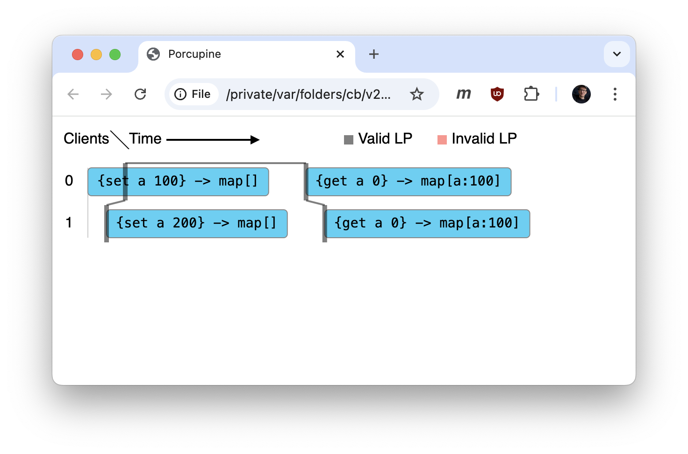

# Linearizability playground in Go with Porcupine

```console
$ go version
go version go1.23.2 darwin/arm64
$ go build
$ ./linearizability-playground
2024/10/28 20:14:07 wrote visualization to /var/folders/cb/v27m749d0sj89h9ydfq0f0940000gn/T/3741143755.html
$ open /var/folders/cb/v27m749d0sj89h9ydfq0f0940000gn/T/3741143755.html
```


